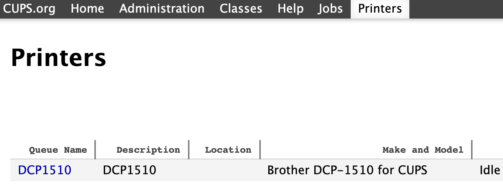

# Brother DCP-1510 CUPS Wrapper

Install Brother DCP-1510 printer into your CUPS subsystem on Linux.



## Installation

```
mkdir build
cd build
cmake ..
make
sudo make install
```

## Usage

The printer will be installed with `lpadmin` upon the CMake installation above. You should start seeing your printer in the list of printers managed by CUPS at `http://localhost:631` as shown on the screenshot.

## Dockerization

```
docker buildx build --platform linux/arm64 -t printing-kiosk-brother-dcp1510-cups:latest .
docker tag printing-kiosk-brother-dcp1510-cups docker.local/printing-kiosk-brother-dcp1510-cups
docker login docker.local
docker push docker.local/printing-kiosk-brother-dcp1510-cups
```
